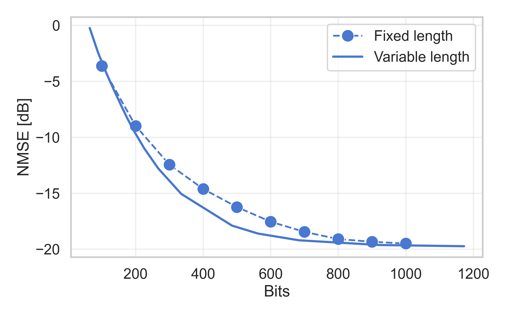

# A Reimplementation of Multi-Rate Variable-Length CSI Compression for FDD Massive MIMO

Unofficial implementation of the [paper](https://ieeexplore.ieee.org/document/10448212):

> B. Park, H. Do and N. Lee, "Multi-Rate Variable-Length CSI Compression for FDD Massive MIMO," _ICASSP 2024 - 2024 IEEE International Conference on Acoustics, Speech and Signal Processing (ICASSP),_ Seoul, Korea, Republic of, 2024, pp. 7715-7719.

This implementation is built on top of the [CompressAI](https://github.com/InterDigitalInc/CompressAI.git) library.

## Preliminaries

1. Install the requirements. 

2. Download the dataset:

    ```
    curl -L -o COST2100_dataset.zip "https://www.dropbox.com/scl/fo/tqhriijik2p76j7kfp9jl/h?rlkey=4r1zvjpv4lh5h4fpt7lbpus8c&e=2&st=pmf7duk6&dl=1"
    ```

    ```
    unzip COST2100_dataset.zip -d COST2100_dataset
    ```

    ```
    rm -f COST2100_dataset.zip
    ```
3. Edit the dataset path in `cost_loader.py` line 39:

    ```
    general_path = '/MY_DATASETS/COST2100_dataset/'
    ```

## Train the model

```
python3 main.py -train --name test1
```

## Test the model

```
python3 test_bit_budgets.py --run lambda-5e-4_div11.8
```

## Results
The results closely match those presented in the paper.



## Citation

If you find this repo useful please cite:

```bibtex
@misc{rizzello2026-csi-feedback-vbr,
  author = {Rizzello, Valentina},
  title = {A Reimplementation of Multi-Rate Variable-Length CSI Compression for FDD Massive MIMO},
  year = {2026},
  howpublished = {\url{https://github.com/vrizz/csi-feedback-vbr}},
}
```

```bibtex
@INPROCEEDINGS{park2024-multi-rate,
  author={Park, Bumsu and Do, Heedong and Lee, Namyoon},
  booktitle={ICASSP 2024 - 2024 IEEE International Conference on Acoustics, Speech and Signal Processing (ICASSP)}, 
  title={Multi-Rate Variable-Length CSI Compression for FDD Massive MIMO}, 
  year={2024},
  volume={},
  number={},
  pages={7715-7719},
}
```

## Related work

| Publication        | Code |
|--------------------|------|
| [User-Driven Adaptive CSI Feedback With Ordered Vector Quantization](https://ieeexplore.ieee.org/document/10208156) | https://github.com/vrizz/csi-feedback-ovq  |
| [Changeable Rate and Novel Quantization for CSI Feedback Based on Deep Learning](https://ieeexplore.ieee.org/document/9799802) | https://github.com/ch28/CHNet  |
| [Machine learning-based CSI feedback with variable length in FDD massive MIMO](https://ieeexplore.ieee.org/document/9928062) | https://github.com/matteonerini/ml-based-csi-feedback |